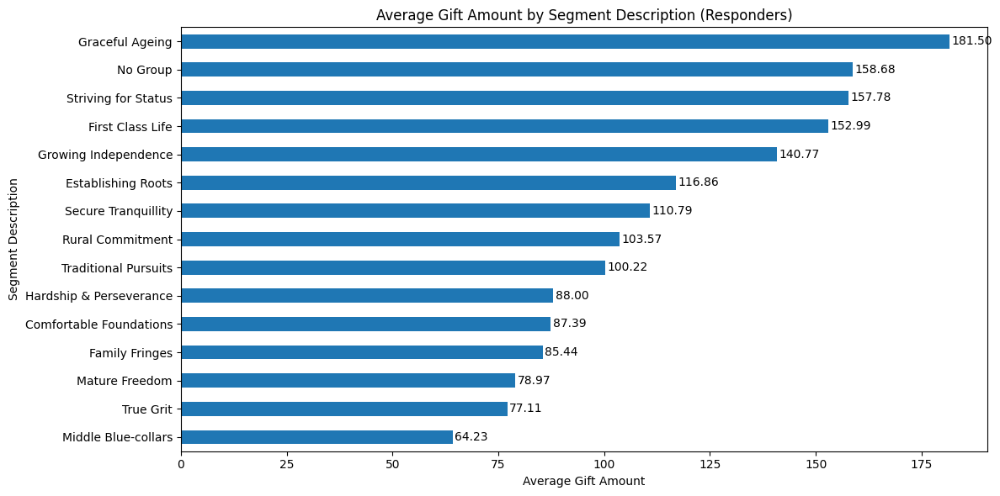
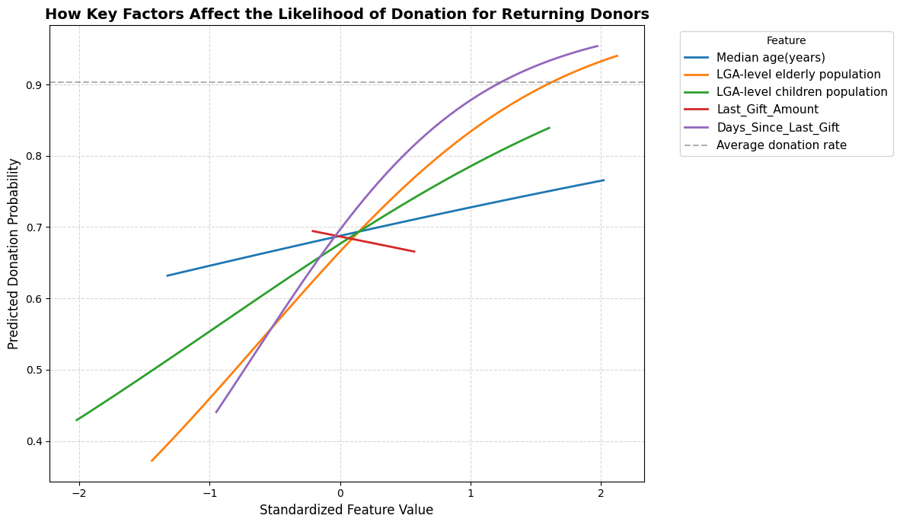

# UNICEF Donor Response Prediction
Machine Learning | Predictive Modelling | Fundraising Analytics

## Project Overview
This project develops a machine learning model to predict donor responses to direct mail (DM) fundraising campaigns for UNICEF Australia. The goal is to improve donor targeting by identifying individuals who are most likely to respond to fundraising appeals.

Using historical donor behaviour and campaign data, several predictive models were developed to estimate the probability that a donor will make a donation within three months after receiving a fundraising letter.

By applying predictive analytics, this project demonstrates how data-driven decision making can help nonprofit organisations improve fundraising efficiency and maximise campaign return on investment.

---

# Business Problem

UNICEF Australia relies heavily on direct mail fundraising campaigns to support humanitarian programs aimed at improving children's health, education, and welfare worldwide.

However, traditional mail fundraising faces several challenges:

- Declining donor response rates
- Increasing mailing and printing costs
- Competition from digital fundraising channels
- Donor fatigue due to repeated appeals

Sending letters to donors who are unlikely to respond leads to higher operational costs and reduced campaign efficiency.

Therefore, UNICEF requires a data-driven donor targeting strategy to maximise campaign effectiveness.

---

# Project Objective

The objective of this project is to build a **propensity model** that predicts whether a donor will respond to a fundraising campaign within the next three months.

The model helps UNICEF:

- Improve donor targeting
- Reduce unnecessary mailing costs
- Increase response rates
- Optimise campaign return on investment

This problem is framed as a **binary classification task**, where donors are classified as either:

- Likely to respond
- Unlikely to respond

---

# Dataset

The dataset contains historical donor and campaign information provided by UNICEF.

Key characteristics of the data include:

- Donor behavioural history
- Campaign interaction data
- Donation frequency and amounts
- Demographic attributes

The analysis focuses on individual donors located in **Australia and New Zealand**, using campaign data from **2020–2025** to reflect recent fundraising behaviour.

---

# Exploratory Data Analysis

Initial exploration of the dataset revealed several patterns in donor behaviour and donation patterns.

### Donor Segment Analysis

Average donation amounts vary significantly across donor segments. Segments such as **Graceful Ageing**, **First Class Life**, and **Striving for Status** show the highest average donation values, suggesting that targeted engagement with these donor groups may significantly improve fundraising outcomes.

This insight highlights the importance of donor segmentation in improving campaign effectiveness.

---

# Feature Impact on Donation Probability

The analysis shows that **donor recency (Days Since Last Gift)** is one of the strongest predictors of future donations.

Donors who have donated recently are significantly more likely to respond to future fundraising campaigns. Demographic indicators and previous donation behaviour also play important roles in predicting donor response.

Understanding these factors helps identify high-potential donors for future campaigns.

---

# Machine Learning Models

Three machine learning models were implemented and compared:

### Logistic Regression
A baseline model that provides strong interpretability and allows stakeholders to understand how different variables influence donor responses.

### Random Forest
An ensemble tree-based model capable of capturing non-linear relationships between donor characteristics and response behaviour.

### XGBoost
A gradient boosting algorithm designed to achieve strong predictive performance through sequential tree optimisation.

---

# Model Performance Comparison

The models were evaluated using **Weighted F1-score**, which balances precision and recall and is appropriate for imbalanced classification problems.

Results show:

| Model | Weighted F1 Score | Class 1 F1 Score |
|------|------|------|
| Logistic Regression | **0.87** | 0.95 |
| Random Forest | 0.84 | 0.90 |
| XGBoost | 0.85 | 0.91 |

Logistic Regression achieved the best overall performance and showed the smallest difference between training and testing performance, indicating better generalisation capability.

---

# Key Insights

Several important insights emerged from the analysis:

- Donor **recency** is one of the strongest predictors of response likelihood.
- Donors with **higher historical donation frequency** are more likely to respond to future campaigns.
- Donor **segmentation reveals significant variation in donation behaviour**, suggesting opportunities for targeted fundraising strategies.
- Predictive modelling can help identify donors most likely to respond, improving campaign efficiency and reducing unnecessary mailing costs.

---

# Business Impact

The predictive model enables UNICEF to adopt a **data-driven fundraising strategy**.

By targeting donors who are most likely to respond, UNICEF can:

- Reduce campaign costs by avoiding unnecessary mailings
- Improve donor engagement
- Increase fundraising efficiency
- Allocate resources more effectively

These improvements help maximise the impact of fundraising campaigns and support UNICEF’s mission of improving children's lives worldwide.

---

# Tools & Technologies

Python  
Pandas  
Scikit-learn  
XGBoost  
Machine Learning  

---

